# Laporan Praktikum PBO — Pertemuan 02

## Kelas dan Objek: Enkapsulasi

### Identitas

- Nama: Farid Zhahir Muttaqin
- NIM: 4525210105
- Mata Kuliah: Praktikum Pemrograman Berorientasi Objek
- Pertemuan: 05

### Tujuan

Pertemuanini membahas penerapan enkapsulasi pada kelas `Mahasiswa` di Java
dan PHP. Objek mahasiswa menyimpan identitas dan nilai, menjaga data agar
memenuhi aturan, menghitung nilai akhir, serta menentukan huruf mutu.

Nilai akhir dihitung dengan bobot:

- Tugas: 30%
- UTS: 30%
- UAS: 40%

### Kondisi sebelum perubahan

Implementasi awal masih berisi TODO. Nilai akhir belum dihitung, huruf mutu
belum ditentukan, dan validasi data belum diterapkan. Karena itu, program Java
menampilkan nilai `0,00`, mutu `?`, serta pesan masalah ketika nilai di luar
rentang atau NIM kosong dimasukkan.

#### Screenshot kode Java sebelum perubahan

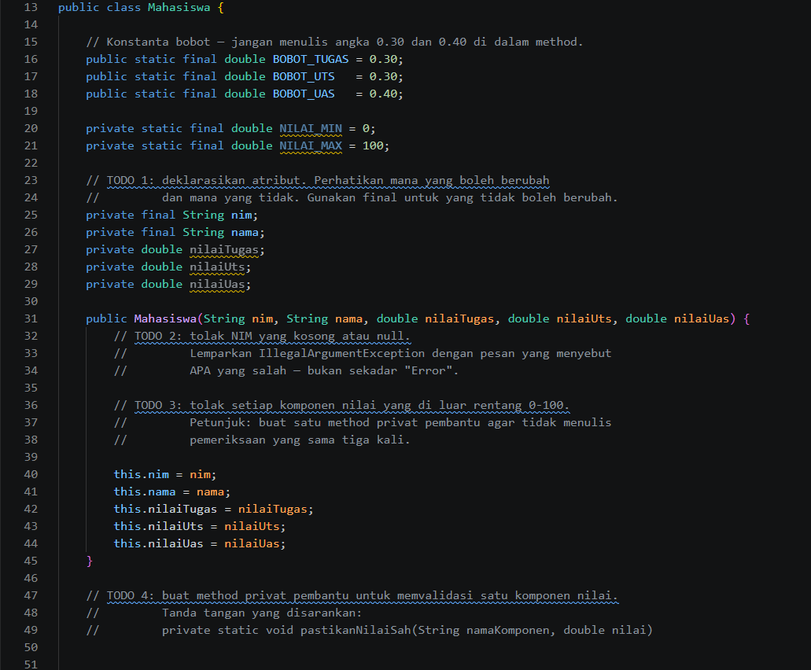

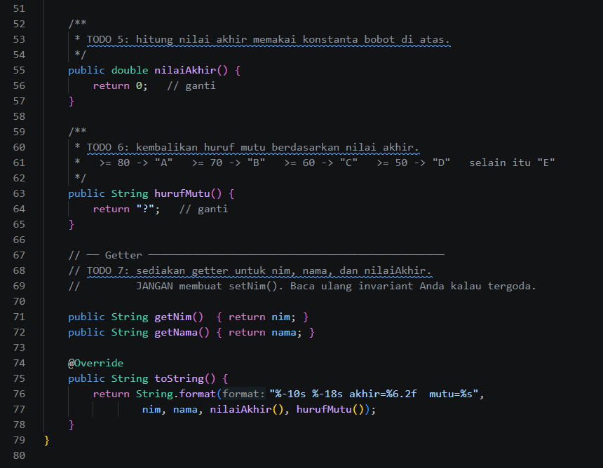

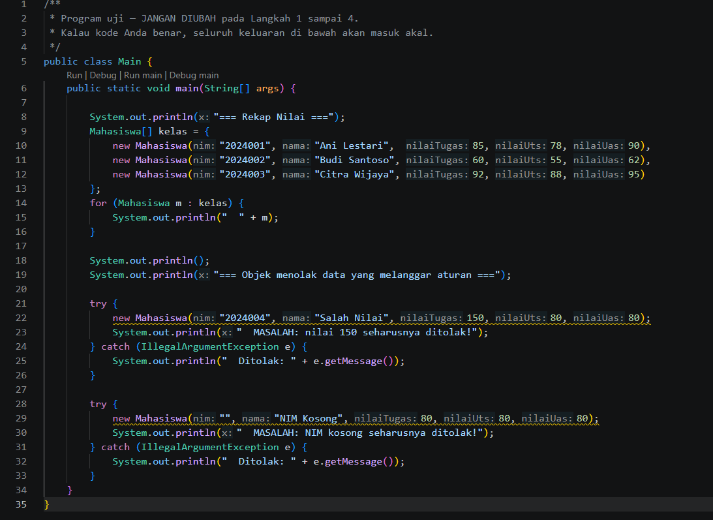

#### Screenshot kode PHP sebelum perubahan

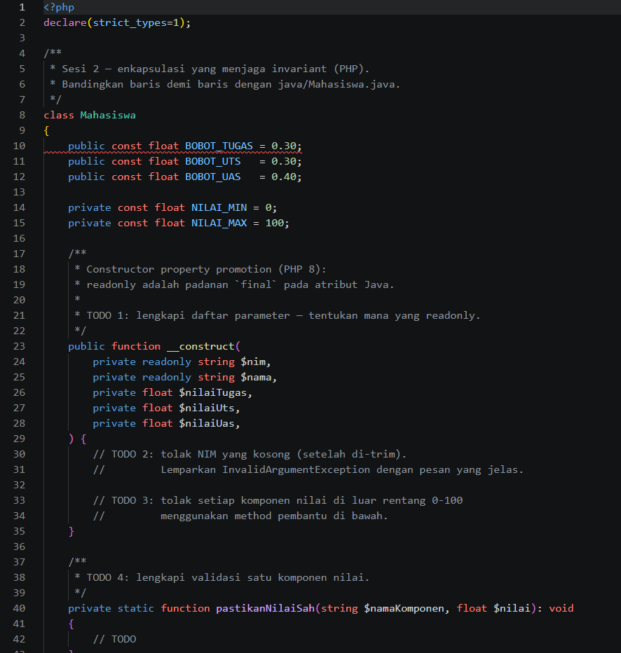

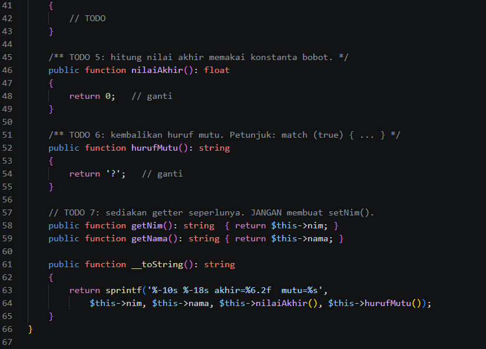

#### Hasil running Java sebelum perubahan

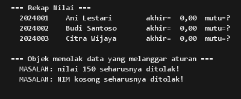

Versi awal PHP belum berhasil dijalankan pada PHP 8.2.12. Source original
menggunakan typed class constants yang memerlukan PHP 8.3 atau lebih baru.

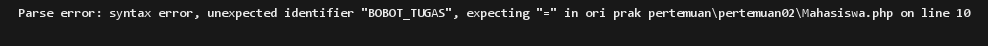

### Perubahan yang dilakukan

Pada kelas `Mahasiswa`, TODO dilengkapi dengan:

1. Validasi NIM agar tidak kosong.
2. Validasi nilai tugas, UTS, dan UAS supaya berada di rentang 0–100.
3. Perhitungan nilai akhir menggunakan bobot yang telah ditentukan.
4. Penentuan huruf mutu: A untuk nilai minimal 80, B minimal 70, C minimal 60,
   D minimal 50, dan E untuk nilai di bawah 50.
5. Getter untuk data yang perlu dibaca tanpa menyediakan setter untuk NIM.

`Main.java` tetap menjadi program uji. Kelas `Mahasiswa` tidak berjalan
sendiri; hasilnya ditampilkan oleh program utama yang membuat objek mahasiswa.

#### Screenshot kode Java setelah perubahan

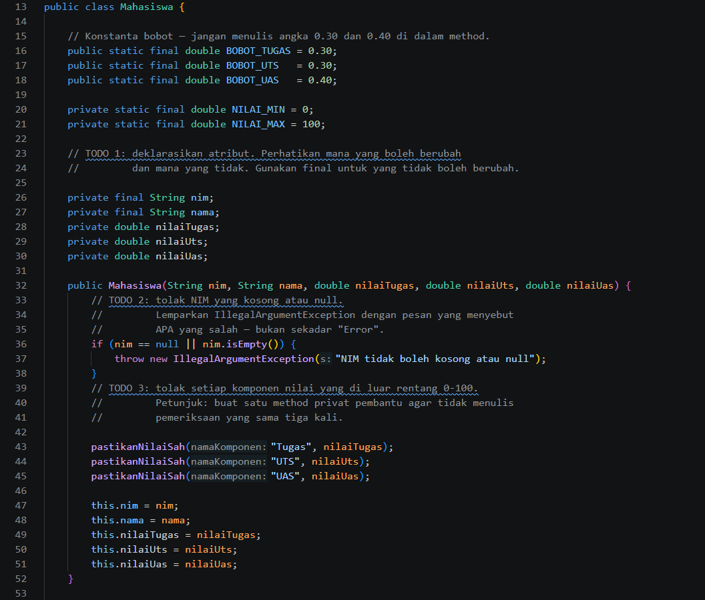

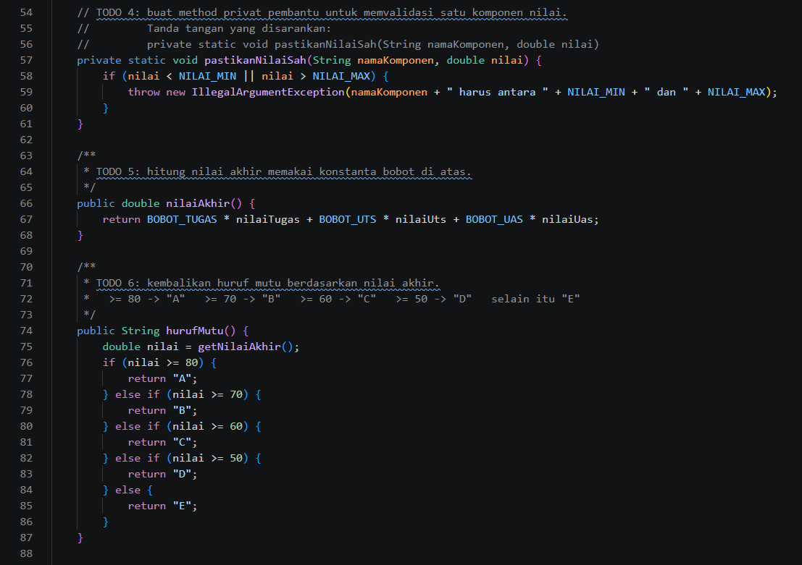

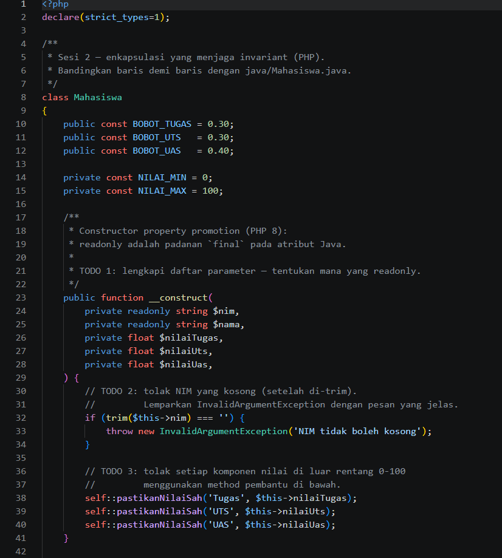

Kode program Java sederhana:

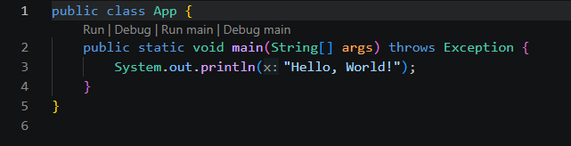

#### Screenshot kode PHP setelah perubahan

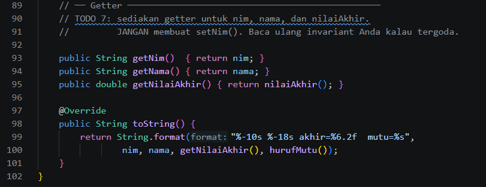

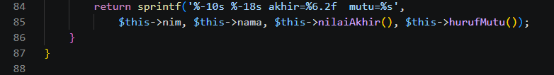

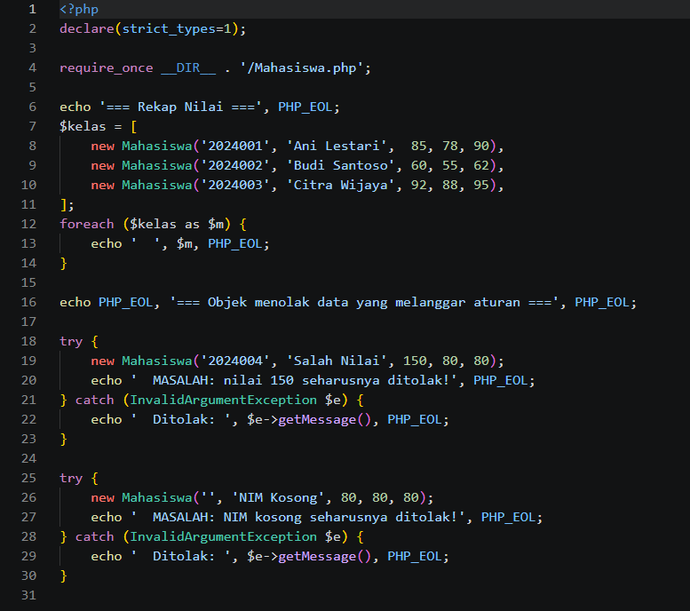

Program utama PHP:

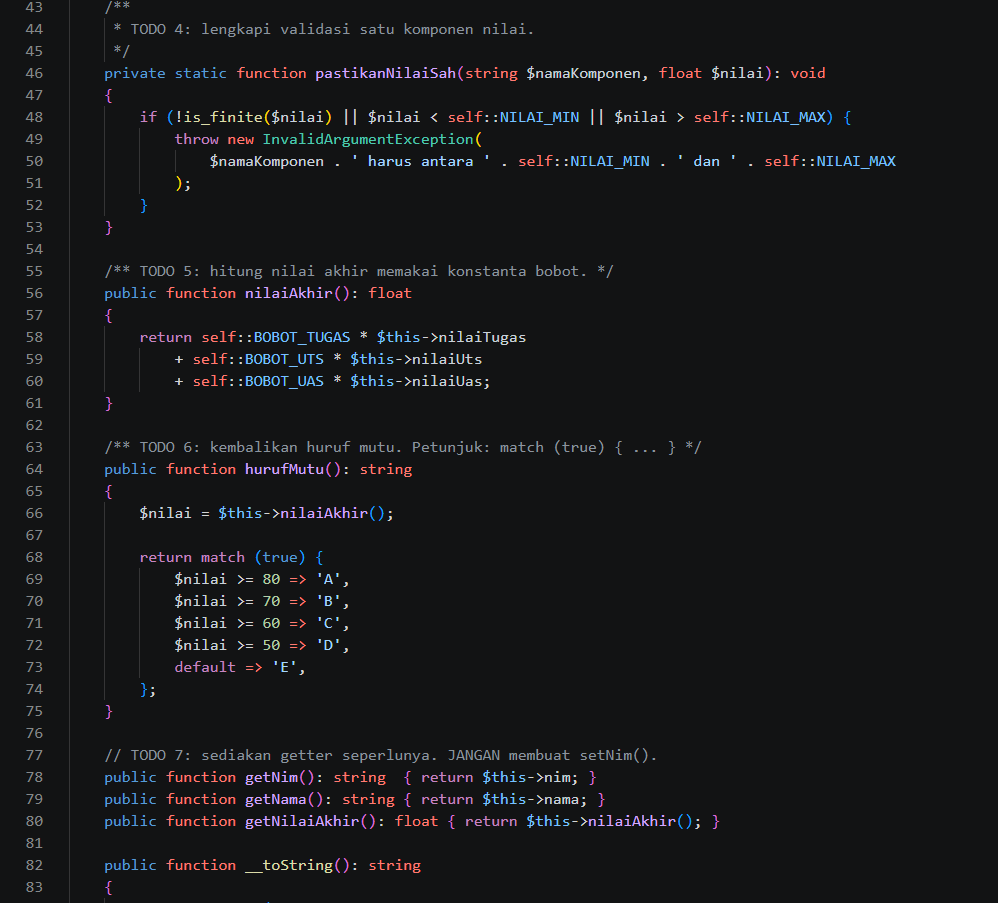

### Hasil running setelah perubahan

#### Java

Program Java menghitung nilai akhir dan huruf mutu dengan benar. Program juga
menolak nilai 150 dan NIM kosong dengan `IllegalArgumentException`.

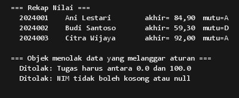

Sebagai program Java terpisah, `App.java` menampilkan output berikut:

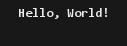

#### PHP

Setelah kelas dan program utama PHP dilengkapi, program dapat dijalankan.
Hasil perhitungan serta penolakan input tidak valid sesuai dengan implementasi
Java.

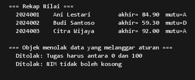

### Kesimpulan

Setelah perubahan, kelas `Mahasiswa` menerapkan enkapsulasi dengan menjaga
validitas data melalui konstruktor, menghitung nilai akhir sesuai bobot, dan
menentukan huruf mutu. Hasil running Java dan PHP menunjukkan data valid
diproses, sedangkan data yang melanggar aturan ditolak.
