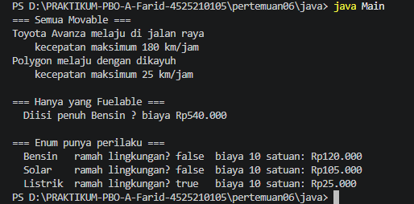
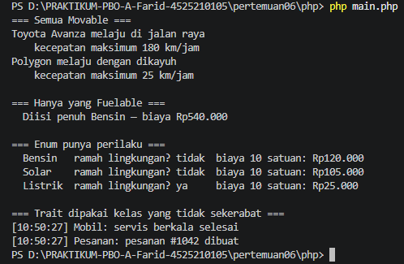

# Praktikum PBO - Pertemuan 06

## Identitas

- **Nama:** Farid Zhahir Muttaqin
- **NPM:** 4525210105
- **Materi:** Interface, abstract class, enum, dan trait

# Penjelasan Konsep

### Interface

`Movable` menetapkan kontrak bagi objek yang dapat bergerak, sedangkan `Fuelable` menetapkan kontrak bagi objek yang dapat diisi bahan bakar. `Mobil` mengimplementasikan kedua interface tersebut. `Sepeda` hanya mengimplementasikan `Movable`, sehingga dapat diproses bersama mobil sebagai objek yang bergerak tetapi tidak dapat diberikan ke `isiPenuh`, yang menerima `Fuelable`.

Pada Java, pemanggilan `isiPenuh(sepeda)` ditolak saat kompilasi karena `Sepeda` bukan `Fuelable`. Di PHP, deklarasi tipe parameter yang sama menghasilkan `TypeError` ketika fungsi dipanggil. Pemisahan kontrak ini mencegah kode memperlakukan semua kendaraan seolah-olah memiliki kemampuan yang sama.

### Abstract class dan pewarisan

`Kendaraan` menyimpan data dan perilaku umum kendaraan, seperti merek, tahun, umur, dan representasi teks. Kelas ini abstrak karena jumlah roda bergantung pada jenis kendaraan. `Mobil` dan `Sepeda` mewarisinya dan memberikan implementasi jumlah roda masing-masing.

Java mengizinkan satu superclass, tetapi beberapa interface. Dengan demikian, implementasi dan state bersama diwariskan dari satu kelas, sedangkan beberapa kemampuan dapat dinyatakan melalui kontrak interface.

### Enum dengan perilaku

`TipeBahanBakar` membatasi pilihan bahan bakar pada Bensin, Solar, dan Listrik. Enum juga menyimpan label dan harga satuan, menghitung biaya pengisian, serta menentukan apakah bahan bakar ramah lingkungan. Pada PHP, enum menggunakan nilai string dan `match` untuk memilih label serta harga.

### Default method dan trait

Interface Java `Movable` menyediakan default method `ringkasanGerak()` yang membentuk ringkasan dari kecepatan maksimum objek. Implementasi seperti `Mobil` dan `Sepeda` dapat memakai perilaku bawaan tersebut.

PHP menggunakan trait `Loggable` untuk berbagi method log tanpa hubungan pewarisan. Trait tersebut dipakai oleh `Mobil` dan `Pesanan`, walaupun `Pesanan` bukan turunan `Kendaraan`.

### Validasi bahan bakar

Pengisian bahan bakar menolak jumlah yang tidak positif atau tidak finite, serta menolak pengisian yang melampaui kapasitas tersisa tangki.

## Screenshot Hasil Running

### Java

**Hasil running Java** *(tangkapan layar terminal yang dikirim pengguna)*

### PHP

**Hasil running PHP** *(tangkapan layar terminal yang dikirim pengguna)*

#